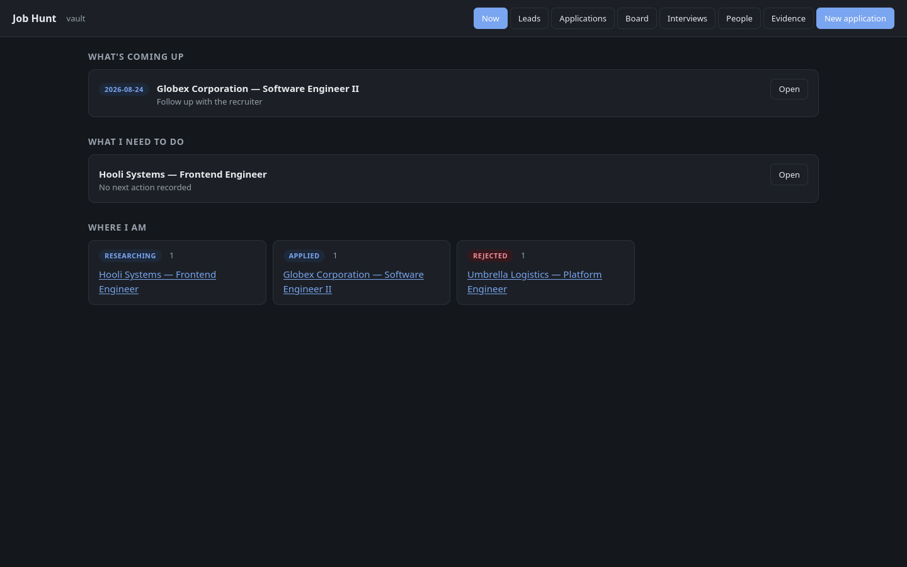
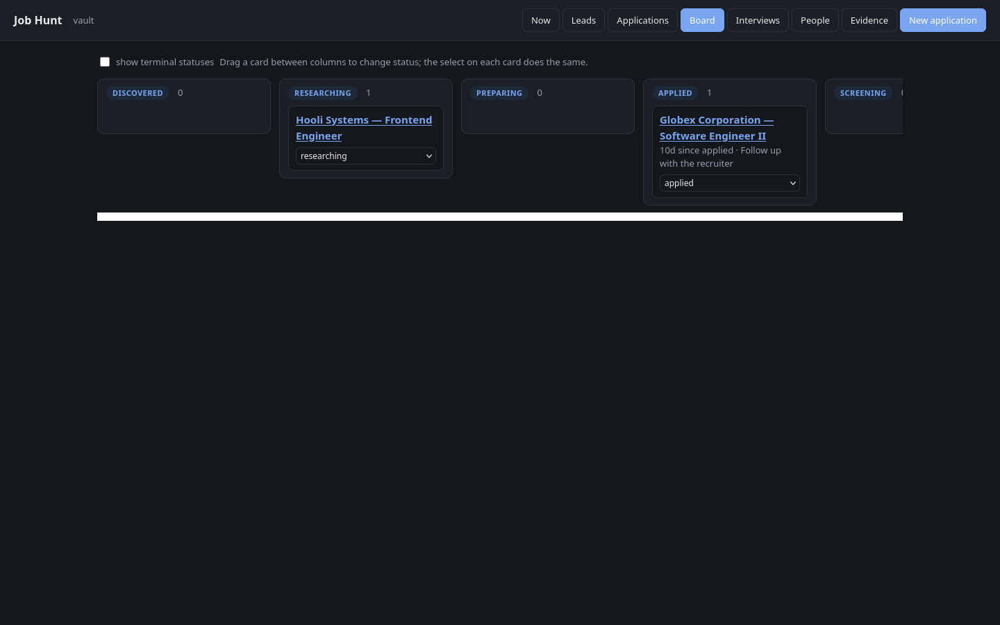
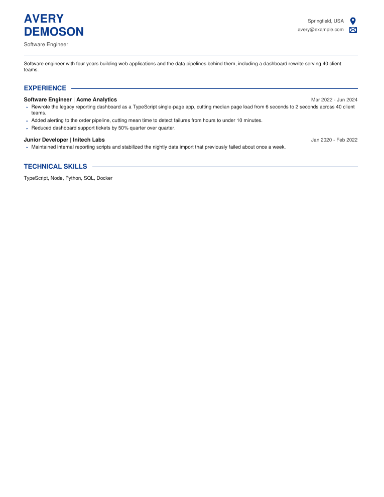

# career-evidence

A job-hunt system built on plain markdown: an [Obsidian](https://obsidian.md)
vault of verified career evidence, plus AI-agent skills and scripts that turn
it into tailored resumes, cover letters, and an application tracker.

The premise: resume writing under pressure always drifts — numbers round up,
shared work becomes sole work, keywords get claimed without backing. Here,
every claim traces to an evidence note, and every job posting is stored
verbatim and checksummed so analysis can't quietly reshape it.

## What you need

- **Python 3** — nothing to install, the scripts are stdlib-only.
- **Obsidian** (free) — for reading and editing your vault. Optional but
  recommended; everything is plain markdown either way.
- **An AI agent** — Claude Code picks the skills up automatically when you
  open this repo. Other agents can be pointed at `.agents/skills/`.
- **Ghostscript + Poppler** — only for PDF rendering:
  `pacman -S ghostscript poppler` (Arch), `apt install ghostscript
  poppler-utils` (Debian/Ubuntu), `brew install ghostscript poppler` (macOS),
  or on Windows the Ghostscript installer plus Poppler binaries on `PATH`.

## See it first

Build the demo vault — a fictional job hunt, produced by the same scripts the
real workflows use — and poke around before trusting the system with your own
history:

```sh
python demo/build_demo.py
python .agents/skills/career-evidence/scripts/serve.py --vault demo/vault
```

Or open `demo/vault` in Obsidian. Every name, employer, and number in it is
fictional.

The dashboard's home view answers "what's coming up, what do I need to do,
where am I":



The board shows the pipeline as columns; dragging a card between columns
changes the application's status:



And rendered artifacts are versioned PDFs built from the markdown drafts,
validated before anything is submitted:



## Getting started

1. **Clone the repo** and open a terminal in it.
2. **Create your vault:**

   ```sh
   python .agents/skills/career-evidence/scripts/init_vault.py
   ```

   This creates `vault/` inside the checkout — gitignored, so your personal
   data never enters git history. To keep the vault somewhere else, pass a
   path, then `cp .env.example .env` and set `CAREER_EVIDENCE_VAULT` to it.
3. **Open it in Obsidian:** choose **Open folder as vault** and select the
   created folder. (Not *Create new vault* — that would nest an empty vault
   inside it.) Read `Start Here.md`.
4. **Let your agent interview you.** Open the repo in Claude Code and say
   *"set up my job hunt vault"*. It fills in your contact details, captures
   your first role and accomplishment, and walks you through your first
   application.

## The skills

Each is a slash command in Claude Code, and each also triggers on its own when
the conversation calls for it:

| Skill | Does |
| --- | --- |
| `init-vault` | First-time setup: profile, first role, first application |
| `new-application` | Scaffold a folder, capture the posting verbatim, analyse fit |
| `new-person` | One note per professional connection and their job-search roles |
| `draft-resume` | Tailor a resume draft from verified evidence |
| `draft-cover-letter` | Write a cover letter draft from verified evidence |
| `cross-check` | Validate the drafted resume and cover letter as a pair before rendering |
| `resume-pdf` | Render and validate the resume PDF |
| `cover-letter-pdf` | Render and validate the cover letter PDF |

The `career-evidence` core skill holds the shared rules (evidence, truth,
privacy) and handles everything else: recording accomplishments, tracking
interviews, audits, and status checks.

Prefer no agent? Every workflow has a hand-editable fallback — copy a note
from `assets/templates/` and the scripts still work.

## Everyday commands

With `scripts/` meaning `.agents/skills/career-evidence/scripts/`:

```sh
python scripts/status.py                   # where am I, what's due
python scripts/serve.py                    # same, as a local dashboard (127.0.0.1)
python scripts/new_application.py "Company" "Role"
python scripts/render_pdf.py --app <folder> --kind resume
python scripts/audit_vault.py              # check structure, vocabulary, evidence
```

## Capture from the browser

The `extension/` directory holds a small Chrome/Firefox extension: on a job
posting, click it, name the company and role, and the page's text lands in
your vault as a checksummed verbatim capture with the application scaffolded
around it (or as a lightweight lead). It talks to the local dashboard and
pairs with the per-session token behind the dashboard's **Pair extension**
button — see [extension/README.md](extension/README.md).

## What's in the repo

- `.agents/skills/` — the canonical skills: the `career-evidence` core and the
  seven workflows, with the scripts, references, vault template, and dashboard
  inside it. `.claude/skills/` symlinks these for Claude Code. (Windows: git
  needs Developer Mode and `git config core.symlinks true` to recreate
  symlinks, or use the release zip, which contains real files.)
- `extension/` — the browser capture extension, a plain no-build MV3 add-on.
- `vault/` — your data, if you chose the default location. Yours, gitignored.
- Your vault's `Preferences/` folder — standing instructions for the agent:
  tone, formatting tastes, workflow defaults.

## Rules that are not negotiable

- The markdown notes are the only source of truth; caches are disposable.
- `Application Brief.md` is yours, `Analysis.md` is the agent's, and
  `Job Description.md` is checksummed evidence — never edited.
- A skill with no evidence behind it does not belong on a resume.
- Contact details carry audience levels; anything marked `self` never leaves
  the vault.
- The dashboard binds `127.0.0.1` only and requires a per-session token for
  writes.

## Project

Direction lives in [ROADMAP.md](ROADMAP.md); concrete work is tracked in
[issues](https://github.com/jbped/job-hunt/issues). Changes are listed in
[CHANGELOG.md](CHANGELOG.md), and [CONTRIBUTING.md](CONTRIBUTING.md) covers
the ground rules for pull requests.

## License

[MIT](LICENSE)
